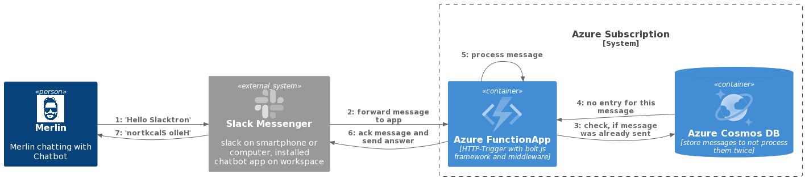

## Slacktron: A Template for Building Your Slackbot with Azure Functions and TypeScript

### Overview

Slacktron is a template designed to facilitate the development of Slackbots using TypeScript and Azure Functions. This template aims to provide a cost-effective solution for hosting Slackbots in the cloud, ensuring they remain accessible around the clock with minimal to no running costs. By leveraging Azure Functions within a Consumption Plan, developers can achieve scalability and efficiency, navigating through certain technical challenges that this setup presents.

### Architecture

The architecture of Slacktron is built around the interaction between Slack, an Azure Function App, and Azure Cosmos DB, providing a streamlined process for handling messages and commands within Slack. The sequence of interaction is as follows:

1. **User Interaction**: The process begins when a user sends a message to Slack, targeting a specific chatbot.
2. **Slack Forwarding**: Slack receives the message and forwards it to the Azure Function App through a webhook or API set up during the Slackbot configuration.
3. **Duplicate Checking**: Upon receiving the message, the Azure Function App queries Azure Cosmos DB to check for duplicates, ensuring that each message is processed only once.
4. **Database Feedback**: Azure Cosmos DB responds to the query, indicating whether the message is new or a duplicate.
5. **Message Processing**: New messages are processed by the Azure Function App, which can generate responses or trigger actions based on the chatbot's logic.
6. **Response Handling**: The Azure Function App sends the processed response back to Slack, which then delivers it to the user.

This setup demonstrates a robust framework for managing interactions with Slackbots, facilitated by the integration of Azure services.

### Technical Details

#### The Azure Function

The core of Slacktron lies within the Azure Function, specifically designed to handle HTTP triggers. 
The Slack Bolt Framework is utilized for managing event handling, abstracting the complexity of Slack API interactions.

##### Middleware Integration

To route HTTP requests directly to the Bolt app, middleware adaptation is necessary. Slacktron includes an adapted version of middleware, modified to align with the header structure changes in Azure Functions version 4. This middleware ensures seamless integration between incoming HTTP requests and the Slack Bolt Framework.

##### Handling Cold Starts

A notable challenge with Azure Functions is the cold-start issue, particularly relevant in the Consumption Plan. Slacktron addresses this by employing a Cosmos DB container to log and track incoming requests, mitigating the impact of cold starts on response times. This approach ensures that messages are not processed multiple times, avoiding duplicate responses to users. The schema for tracking requests in Cosmos DB is designed to uniquely identify each message, facilitating efficient processing and logging.

#### Deployment and Configuration

Slacktron comes with an ARM template for easy deployment of the necessary Azure resources, including the setup of a development AppSlot for testing and versioning. The template and continuous deployment guidelines streamline the process of integrating changes and maintaining the Slackbot.

### Setup and Integration

#### Slack Configuration

Setting up Slacktron involves creating a Slack Workspace and a new Slack App, configuring it with the Azure Function's URL and App Key. 
You can use the slack_maifest.yaml to do that.
It is crucial to securely manage Slack credentials, such as the Slack Signing Secret and OAuth Tokens, by storing them in the Azure Function's environment variables.

### Conclusion

Slacktron offers a comprehensive template for developers looking to create and deploy Slackbots with Azure Functions and TypeScript. By addressing technical challenges such as cold starts and providing a scalable architecture, Slacktron enables the development of efficient, cost-effective Slackbots suitable for various applications.

**Helpful Links:**

- [Slack Bolt Framework](https://www.npmjs.com/package/@slack/bolt)
- [Middleware Solution](http://github.com/deepbass/bolt-azure-functions-receiver)
- [Adapted Middleware](https://github.com/merlinbecker/slacktron/blob/master/src/utils/AzReciever.ts)
- [CosmosDB Wrapper Class](https://github.com/merlinbecker/slacktron/blob/master/src/utils/Cosmosdb.ts)
- [ARM Template for Azure Functions](https://github.com/merlinbecker/slacktron/blob/master/resources/arm-template/template.json)
- [Continuous Deployment for Azure Functions](https://learn.microsoft.com/en-us/azure/azure-functions/functions-continuous-deployment)
- [Environment Variables Configuration](https://github.com/merlinbecker/slacktron/blob/master/local.settings.example.json)

This README serves as a guide for utilizing Slacktron in your projects, providing the tools and knowledge needed to create dynamic, interactive Slackbots.